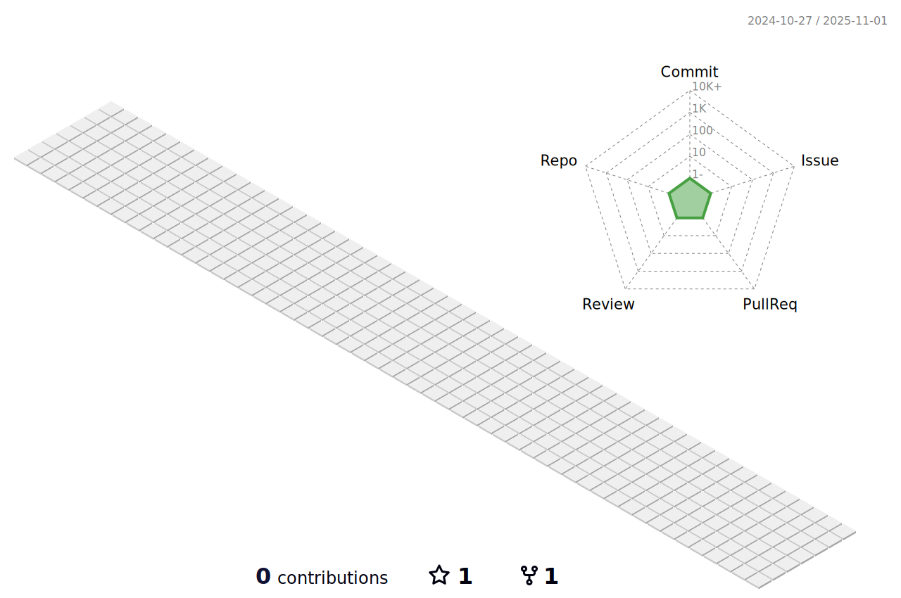

### Hi there 👋 Welcome to my Github page.
 I'm Ravil Matoušek.

A senior web front-end developer with 6+ years of commercial experience in Javascript | React.js | Vue.js | Next.js | Typescript | Nodejs | Express.js | HTML5 | CSS3/SCSS | PHP | Laravel | MySQL | MongoDB | PostgreSQL | REST API | GraphQL | AWS | GIT | Docker | BlockChain | DApp | Smart Contract | NFT | WAX | HIVE | Solidity | Rust | Web3.js.

<!--
**Rolland-K/Rolland-K** is a ✨ _special_ ✨ repository because its `README.md` (this file) appears on your GitHub profile.

Here are some ideas to get you started:

- 🔭 I’m currently working on ...
- 🌱 I’m currently learning ...
- 👯 I’m looking to collaborate on ...
- 🤔 I’m looking for help with ...
- 💬 Ask me about ...
- 📫 How to reach me: ...
- 😄 Pronouns: ...
- ⚡ Fun fact: ...
-->

<h2>Languages & Status</h2>

  

  
  

  
  
  
  

  
  
  
  
  
  
  

  
  
  

  
  
  
  

  
  
  
  
  
  

